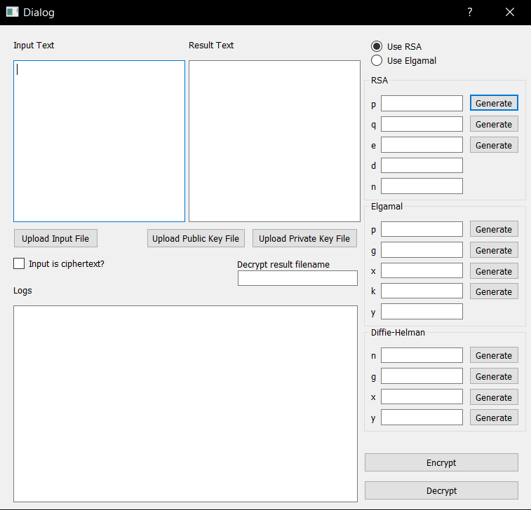
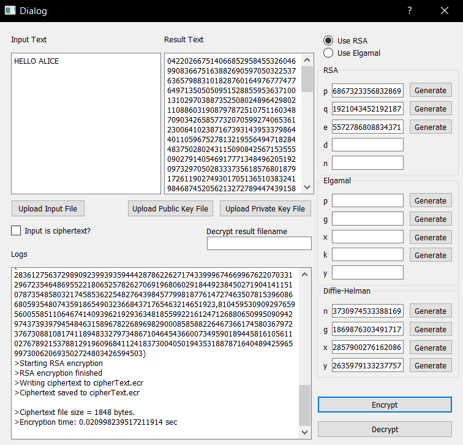
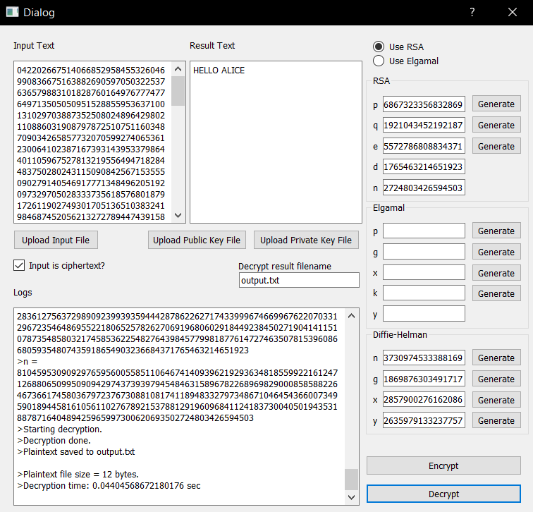

# RSA-ElGamal Public Key Cryptography with Diffie-Helman Key Exchange

Made by:
- Eka Novendra Wahyunadi (13517011)
- Nixon Andhika (13517059)

### Requirement
1. Python version 3.8 or newer
2. PyQt
3. PyCriptoDome

### How to Run
1. Go to root directory RSA-Elgamal/
2. Install requirement
    ```sh
    pip install -r requirements.txt
    ```
3. Start the program
    ```sh
    python mainApp.py
    ```

### How to Use
##### Input Diffie-Helman Parameters
1. Insert value of prime number n or use generate
2. Insert value of prime number g where g < n or use generate
3. Insert random value x
4. Insert random value y

##### Encryption/Decryption with RSA
- Encryption
    1. Input value of prime number p or use generate
    2. Input value of prime number q or use generate
    3. Input value of e which is a coprime of (p-1) * (q-1) or upload public key file (.pub)
- Decryption
    1. Input value of private key d or upload private key file (.pri)
    2. Input value of n (p * q) or upload private key file (.pri)
    3. Input the result filename

##### Encryption/Decryption with ElGamal
- Encryption
    1. Input value of prime number p or use generate or upload public key file (.pub)
    2. Input random value g or use generate or upload public key file (.pub)
    3. Input random value x or use generate
    4. Input random value k or use generate
- Decryption
    1. Input value of private key x and p or upload private key file (.pri)
    2. Input the result filename

#### Screenshots


